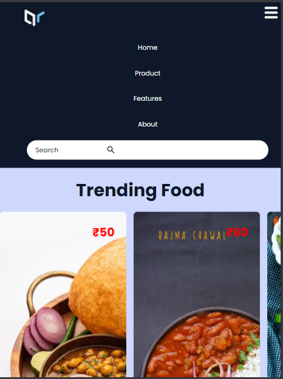
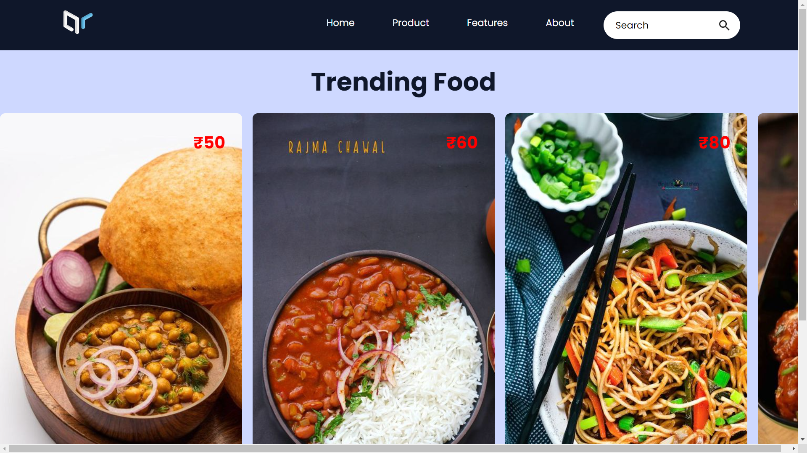

# 3D-Carousel App
This React web application featuring a sleek and responsive navbar along with a basic carousel component!

## Features ✨

- **Responsive Navbar :** Navbar adjusts elegantly to different screen sizes, ensuring a consistent and user-friendly layout on all devices.

    

- **Coverflow Carousel :** The carousel component showcases photos in a basic coverflow effect

    

- **React Components :** Both the navbar and carousel are implemented as reusable React components, allowing for easy integration and maintenance.

## Available Scripts

In the project directory, you can run:

### `npm start`

Runs the app in the development mode.\
Open [http://localhost:3000](http://localhost:3000) to view it in your browser.

The page will reload when you make changes.\
You may also see any lint errors in the console.

### `npm run build`

Builds the app for production to the `build` folder.\
It correctly bundles React in production mode and optimizes the build for the best performance.
